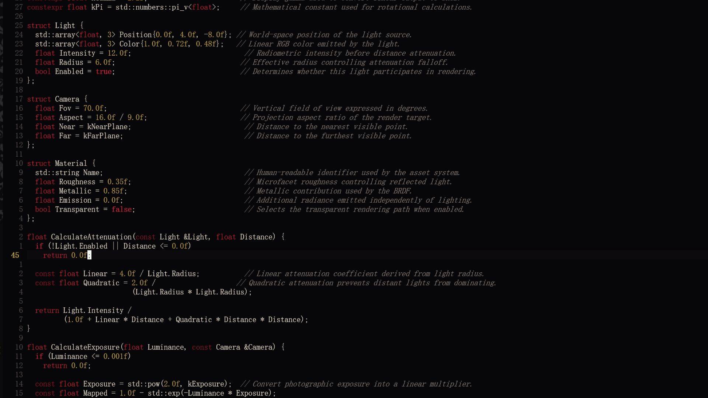

# gore.nvim

<a href="https://dotfyle.com/plugins/YedTheEmo/gore.nvim">
	
</a>

A high-contrast dark colorscheme for Neovim inspired by Gothic aesthetics.



## Overview

`gore.nvim` is a high-contrast dark theme designed for focus and readability. Instead of common blue and purple palettes, it uses a deep near-black background paired with warm ivory foreground text, muted gold tones, and crimson accents.

### Key Characteristics

- **High Contrast**: Clean separation between foreground code elements and background layers.
- **Warm & Earthy Palette**: Ivory, gold, and red accents replacing standard cool-toned themes.
- **Minimal Dependencies**: Pure Lua implementation with no external plugin requirements.

## Requirements

- Neovim 0.10+
- A terminal with true-color (24-bit) support (`termguicolors`)

## Installation

### Native Package (`packpath`)

#### Linux / macOS

```sh
git clone https://github.com/YedTheEmo/gore.nvim \
  ~/.local/share/nvim/site/pack/gore/start/gore.nvim
```

#### Windows (PowerShell)

```powershell
git clone https://github.com/YedTheEmo/gore.nvim `
  "$env:LOCALAPPDATA\nvim-data\site\pack\gore\start\gore.nvim"
```

### Manual Installation

Copy `colors/gore.lua` directly into your Neovim colors directory:

- **Linux / macOS**: `~/.config/nvim/colors/gore.lua`
- **Windows**: `%LOCALAPPDATA%\nvim\colors\gore.lua`

## Usage

Enable the colorscheme in your `init.lua`:

```lua
vim.opt.termguicolors = true
vim.cmd.colorscheme("gore")
```

Or run interactively in Neovim:

```vim
:colorscheme gore
```

## Project Status

`gore.nvim` is currently in active early development.

## License

[MIT](LICENSE)

